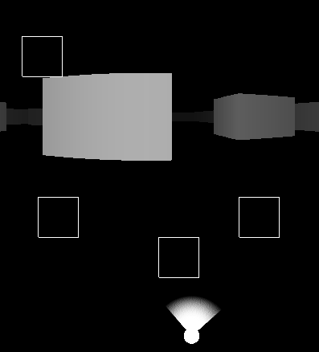
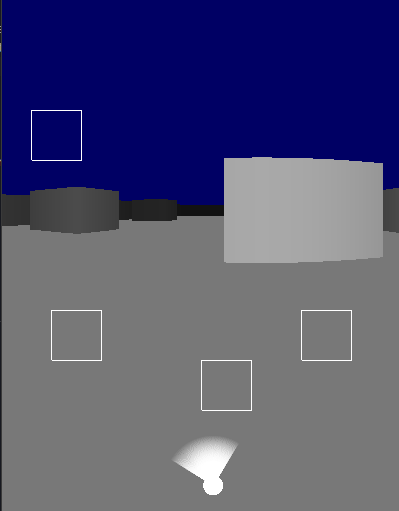
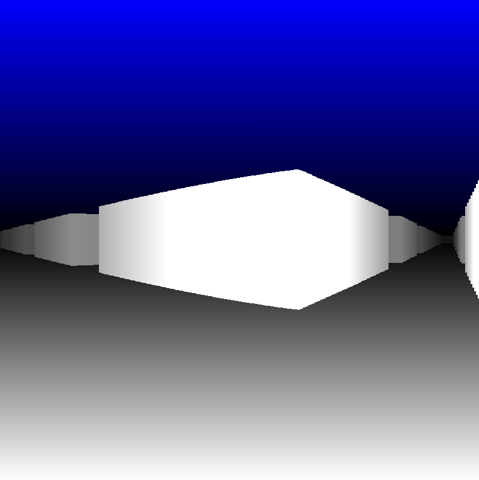

# 3D Simple Raycasting

This project idea was brought to my attention by [The Coding Train](https://www.youtube.com/watch?v=vYgIKn7iDH8).

I can very much recommend to try it out. It is fun to create some little 3D rendering.

The main file that I also used to run this is `src/Main.cpp`. All the other files are boilerplate from [here](https://github.com/rewrking/sfml-vscode-boilerplate) and required to run SFML on VSCode.

### Early version with raycasting

### Fixed colors of far away and added boxes

### Added ceiling and floor colors

### Added gradient to ceiling and floor
